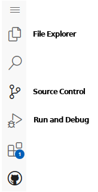

# Sample Assignment

This is a simple C++ assignment for practice using Github Classroom and
Codespaces.

Write a C++ program that prompts for and inputs two integers, then calculates
and outputs the sum of those two integers.

Here is a sample run of the program:

```
Enter first integer: 15
Enter second integer: 22

The sum is 37.
```

A source code file named *sample.cpp* is included in this project for you
to add your code. When you are ready to test your code, use the "Run and Debug" 
button on the left side panel (your editor must be open to the file you wish
to compile and run, i.e. *sample.cpp*), then click the run button (green triangle)
near the top left of the screen. The program output will appear in the 
lower panel. Note that the lower panel contains tabs for "Debug Console" and 
"Terminal". Your program runs in the "Terminal" tab - you may have to switch to
it manually.

When your program is finished and you are ready to submit the assignment, you
must "push" your changes to the Github repository. Do this using the "Source Control"
button in the left panel. First, you need to commit your changes to the project.
This saves your project changes to the local repository, but does not submit to
your Github repository (you instructor will only see your Github repository).

When you commit changes to your project, you must provide a brief description
of your update to the code repository. You may enter this description in the
message above the "Commit" button. Or, if you do not enter the description,
a code editor will open for you to enter the message. In that case, add your
message using the editor and close the editor.

Once you are ready to submit the project to your instructor, you must push your
local reposity to the Github repository. Again, use the "Source Control" button
and "push" (or "sync") your local repository to the Github repository.
The "Commit" button changes to "Sync" when you have local changes that 
have not been pushed.
***Be sure to sync your changes prior to the due date of the assignment.***

You can sync changes up to the due date for the assignment.
Once you have synced ("pushed" in *git* terms),
the repository is available to your instructor for grading.
Note that you will be unable to push changes after the due date as the
repository becomes read-only.


